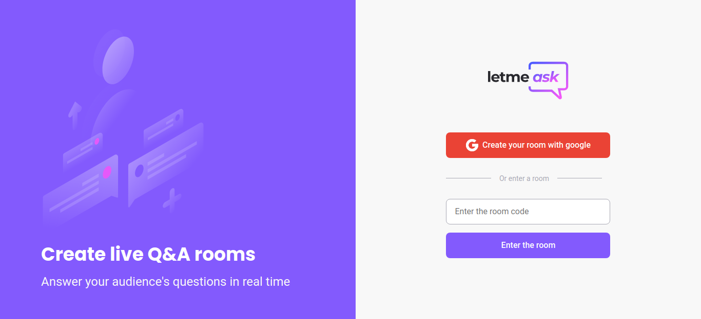

<p align="center">
  
</p>

<p align="center">
  

  

  
</p>

<h1 align="center">
  
</h1>

<br>

## 🧪 Technologies

This project was developed using the following technologies:

- [React](https://reactjs.org)
- [Firebase](https://firebase.google.com/)
- [TypeScript](https://www.typescriptlang.org/)
- [Sass](https://sass-lang.com/)

## 🚀 How to execute

First, clone the project folder and access it.

```bash
$ git clone https://github.com/GabrielCordeiroDev/let-me-ask
$ cd let-me-ask
```

To run it, follow the steps below:

```bash
# Install all dependencies
$ yarn

# Run the project
$ yarn start
```

You will need to create a [Firebase](https://firebase.google.com/) account and also a project to make a Realtime database available.

The app will be available in your browser at: http://localhost:3000

## 💻 Project

The Letmeask app was developed during NLW 06, an online event with the aim of taking you to the next level, thinking about content creators, the app allows you to create Q&A rooms with your audience, and all this in real time! 

## 📝 License

This project is licensed under the MIT License - see the [LICENSE.md](https://github.com/GabrielCordeiroDev/let-me-ask/blob/main/LICENSE) file for details.
